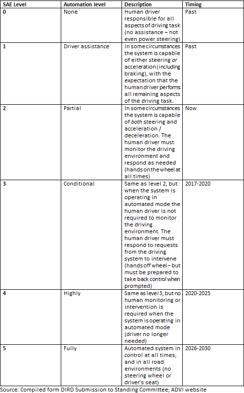
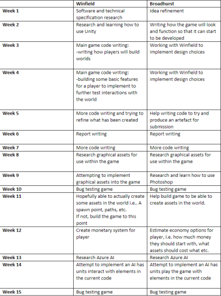

<html>
  <head>
    <h1> The Kyles</h1>
      <h2> Kyle Winfield </h2>
        
My name is Kyle Winfield, student number s3541867.
        I'm a 23 year old student studying IT, I have worked various jobs from casual hospitality to basic IT helpdesk support.
         
        I've been playing competitive video games for the last few years and spend most of my free time doing so. It is my main hobby and interest.
         
        My interest in it has developed from a young age, where I spent my time using the computer and playing video games. In school, I took an interest in computer networking and was quite passionate about it. Later on in my life, I worked for the DHHS doing level 1 IT help desk support.
        

         
        <a href="https://kylewinfield.github.io/Assignment1--My-Profile/">
        
Kyle Winfield's Profile
 </a>

         

        
         
        
         
        
         

      <h2> Kyle Broadhurst </h2>
      
 My name is Kyle Broadhurst, my student id is s3851557 and I'm a 23 year old born in Sydney and raised in Bendigo, currently living in Geelong I spend most of my days working at the local Kebab shop and going out with friends. To this day my highest education has been Year 12, I did briefly partake in an accounting course but I dropped it because it conflicted with my job.
       
      My dream is to play Dota 2 professionally, I have flown interstate to compete in events and it has been lots of fun. I have no official experience in IT besides living in the modern age but I am very interested in learning how our technology runs i.e coding.
      

       
      <a href="https://kylebroadhurst.github.io/Assignment01/">
      
Kyle BroadHurst's profile

      </a>
       
      
       
      
       
      
       

      <h2>Personality Comparison</h2>
      

      We found our team to score very high on the openness aspect, so we knew it would be a good idea to lay out the assignment early on and decide who does what, we also worked together on discord to keep communication lines open .
      

      <h2> Group processes</h2>
      

      The group worked in a fast, efficient and productive manner in Assignment 2. With only 2 members of the group, there is little confusion about any tasks, and if there is it is able to be quickly resolved since there are less lines of communication that need to be used.
      There won't be any changes from the way the group worked in Assignment 2 as we feel there is no need.
      

      <h2>Ideal Jobs Comparison</h2>
        <h3>Kyle Winfield's job ad</h3>
          
        <h3> Kyle Broadhurst's job ad</h3>
          

       

      

      Both our dream jobs require a great understanding of coding, with multiple years of prior experience. Both jobs need you to be a self motivated worker and are very rewarding for being so. The main difference between the jobs is the Singaporean one is more hardware based while the other one is entirely focused of software. It would be safe to safe both career plans follow a similar  path in the IT industry, just a difference in the outputs.
      

      <h2>Career plans</h2>
      

      While comparing our ideal jobs, it's easy to see that we both need some strong coding skills in C++, the differences lie in while Broadhurst's job is about learning how game engines work and taking into account game design, Winfield's job is about optimizing a high performance software system that has critical needs of accuracy, precision and speed.
       
      Both jobs obviously require teamwork skills, as do most jobs in software development, which comes along with strong communication skills in order to be a good team member.
       
      Our career plans require a similar skill set just in a different implementation for the experience required to achieve our respective dream jobs. Broadhurst would likely want a resume with some more creative tasks and experience on it, while Winfield would be more interested in the design of efficient code and experience in designing any high performance software system.
      

      <a href="https://github.com/kylewinfield/Assignment2">
      
Group repository

      </a>

</head>

<body>
  <h2>Industry Data</h2>
    

    Both our job titles are Software engineer. Software engineer ranks as the 11th most in demand job in the IT industry according to Burning Glass Technologies. The general skills required for these jobs are communication skills, problem solving,  writing, team work, troubleshooting, planning, time management, quality assurance, meeting deadlines, team building, multitasking, English and decision making, while the IT exclusive skills are SQL, Javascript, C#, C++, DLL, Git, .NET programming and project management.
 
Our groups IT specific skills rate quite highly in terms of demand from employers with SQL and Javascript topping the chart, it is a similar story with our general skills with our requiring chart toppers communication skills, problem solving and writing. The three highest IT specific not required by our job are JAVA, Microsoft windows and SAP while the three highest general skills not required are organisational skills, planning and being detail orientated.
 
After looking at the Burning Glass data, I've gained a better appreciation  and understanding of the skills  required for my ideal job, having the skills laid out like that makes me feel like my ideal job is actually more achievable and the steps towards it can be more easily taken.

  <h2>IT Work</h2>
    <h3>Software Engineer</h3>
     

     <a href="https://www.youtube.com/watch?v=vRSRElAIdsU">
     https://www.youtube.com/watch?v=vRSRElAIdsU
     </a>

 
 
This IT professional is a project manager and is responsible for 3-4 projects to manage. He will constantly be checking monitoring the project to see if there are any changes from business needs, customer changing their mind or any other reason and react and adapt with his team as the changes happen.
 
He works closely with his teams around planning those projects, seeing what’s the next phase they are going in to, who is involved, what type of resources he needs, what is the budget, what is the timeline and then communicate this is to everyone in the team and all the stakeholders.
 
He will also look at other projects that have not started yet, so working with a management team, he will help set a vision and set expectation so they can start planning ahead of time to start resourcing for these projects.
 
He deals with various different people in his day to day life. He will directly work with various teams of software engineers to make effectively communicate and keep on top of the dynamic projects that he is responsible for. He must work with a team of project managers to start and help construct, plan and give insight into new projects for the company. The clients and stakeholders he must also be in constant communication with.

<a href="https://www.youtube.com/watch?v=5kas2jBObUY">
https://www.youtube.com/watch?v=5kas2jBObUY
</a>

 
 

She is a product engineer who works a lot of mobile apps, specifically apps related to social and productivity. The engineering she does is directly related to the product that people use.
 
The majority of her time is spent reading, writing and debugging code. This is the primary job of her role.
 
She will spend time working with a product managers, designers and other product engineers in order to make decisions on a project and help shape the direction of how the product will work.
Once the idea is shaped, she will collaborate with other product engineers to build the product.  
This includes coming up with a plan, deciding if she needs to collaborate with other teams in the company, deciding how to format data to show in the desired way and figuring out what resources are required for the product, and whether those resources need to have custom made versions.

    <h3>Network Engineer</h3>
      

      <a href="https://www.youtube.com/watch?v=qpUe7vQSsyI">
      https://www.youtube.com/watch?v=5kas2jBObUY
      </a>

 
 
This IT professional is a Network Engineer, his main job is to maintain the connectivity of computer networks in terms of voice, data and wireless network services within an organization.  
He will be monitoring the ticketing system from the organization's help desk team to see if any tickets have been escalated to him. This is the number one priority and what he spends most of his time doing, since user impact directly reflects on him and his skill to maintain a network.
 
There are also often various projects for him to do, such as firewall/switch migrations, network flow performance adjustments, internet redundancy tests, VoIP adjustments, firmware adjustments and more.  
These tasks are often shared with systems administration teams.
 
He will meet with business stakeholders to discuss potential issues that might come up from works and the progress he and his team are making on projects.

 

<a href="https://www.youtube.com/watch?v=qpZbRUEE_Dc">
https://www.youtube.com/watch?v=qpZbRUEE_Dc
</a>
 
 
This IT professional is a Network Analyst, his main job is to monitor the stores that his company manages in terms of connectivity, and make sure these systems are running smoothly.
He provides level 3 help desk support to clients and will spend a lot of his time dealing with those tickets. This is usually resolving network issues with the clients. Anything with an IP address he will be helping resolve, problems can arise like when a site goes down, he will work with them to get it back up.
 
He will also collaborate with his team to write scripts to help out with automation.
A project he is currently working on is a backup connection device to all of the sites throughout his region, so that if any sites go down there will be a backup to keep it running while they get the site back up and running. This provides some usability while the issue is getting resolved.

<h3>Database Administrator</h3>

<a href="https://www.youtube.com/watch?v=Fp2DPhLM8Kw">
https://www.youtube.com/watch?v=Fp2DPhLM8Kw
</a>

 
 
This IT professional is a Database Administrator, her main role is supporting a specific data base software at her company.
 
She is responsible for maintaining the database ensuring there are no outages and then working her work queue. This queue will consist of some data base changes, helping fix any outages that she might get called in to do, or fine tuning from customer requests.
 
She works with other database administrators to resolve outages as well as direct contact with the clients that the database hosts for.

 

<a href="https://www.youtube.com/watch?v=ZNvn1mJwHiw">
https://www.youtube.com/watch?v=ZNvn1mJwHiw
</a>

 
 
This professional is an Oracle Database Administrator.
First thing he will do in a typical day is check all the databases are up and running, and making sure they didn’t go out in the night and there are no problems.
Then he will check his backups, to make sure they are operational.
 
Direct contact to the clients is something a Database administrator needs to do, troubleshooting with clients and resolving any issue to make sure everyone has access to what they need to and the database itself is running smoothly.
He will have meetings with Project Managers and other Database Administers about upgrades and other things.
 
The rest of his role is mainly just monitoring the databases, making sure everything is running and handling client requests.

<h3> IT Support Technician</h3>

<a href="https://www.youtube.com/watch?v=om8AygYdrto">
https://www.youtube.com/watch?v=om8AygYdrto
</a>
 
 
In this video the mans job is as a support technician for his company. He interacts with other It professionals and clients . His job is to wait for and respond to tickets. Everyday he waits for tickets and answers the phone using Shortell.
 
He also goes out into the field to clients and helps clients with issues such as making user accounts. He does computer imaging. All in all it is safe to say he always has an exciting day with many new challenges every day and that makes him enjoy his job.

<a href="https://www.youtube.com/watch?v=RYdmWa-i7Gs">
https://www.youtube.com/watch?v=RYdmWa-i7Gs
</a>
 
 
Chris is an IT Support Technician at Datacom systems. His job consists of responding the technical questions asked by clients. He spends most of his time responder to questions about application updates, website releases and application releases.
 
He does note that he can work from home on occasion which he enjoys, but the most rewarding aspect of work is the sense of accomplishment he gets when he solves a tough problem. He believes the most challenging aspect of his work is the wide range of skills required for the job.

<h3> IT Manager</h3>

<a href="https://www.youtube.com/watch?v=k0rntQHNu-U">
https://www.youtube.com/watch?v=k0rntQHNu-U
</a>
 
 
Rim is a project manager, her job is to make sure everyone is doing their job, check up on where people are up to and agile project management tasks . Rim interacts with IT professionals only.
 
She spends most of her time at the office except for when she goes out to lunch, in which she goes into the city. The most challenging aspect of their career seems to be time management, making sure she's working as efficiently and possible and meeting deadlines.

<a href="https://www.youtube.com/watch?v=hFhuMGanjT8">
https://www.youtube.com/watch?v=hFhuMGanjT8
</a>
 
 
Simon is an IT manager at Datacom systems. He interacts solely with other IT professionals, project managers and business manager. His day consists of group meeting and one on one chats with other Industry professionals to help them succeed in their roles, although sometimes he does get to travel. His biggest challenge as an IT manager is adapting to new technologies

<h2>IT Technologies</h2>
  <h3>Blockchain and Cryptocurrency</h3>
  

  A blockchain is a growing collection of digital records, called blocks, that are linked through cryptography. Each block contains details of a timestamp, transactional data and the unique ‘cryptographic hash’ of the previous block in the block chain. In that sense all the blocks in the chain are linked.
   
The main benefit of using a blockchain is that it cannot be modified, making all the transactions in the blocks permanent and open to the public.
 
Blockchain can be used in banking, property records, smart contracts, voting, supply chains and most obviously, cryptocurrency.
Blockchain technology is implemented into cryptocurrencies, which are virtual or digital currencies that are secured by using blockchains.
According to Jan Lansky, a cryptocurrency is a system that meets six conditions:
The system does not require a central authority, its state is maintained through distributed consensus.
The system keeps an overview of cryptocurrency units and their ownership.
 
The system defines whether new cryptocurrency units can be created. If new cryptocurrency units can be created, the system defines the circumstances of their origin and how to determine the ownership of these new units.
 
Ownership of cryptocurrency units can be proved exclusively cryptographically.
The system allows transactions to be performed in which ownership of the cryptographic units is changed. A transaction statement can only be issued by an entity proving the current ownership of these units.
If two different instructions for changing the ownership of the same cryptographic units are simultaneously entered, the system performs at most one of them.
 
Cryptocurrencies can be used today online as a currency, with the main difference from other forms of currency being the parties involved are semi-anonymous and the currency itself is decentralized, making it immune from intervention from another party, like the government.
The future of cryptocurrency is an uncertain one, but some say that it needs a verified exchange trade fund, so that it is easier for people to invest in crypto’s like Bitcoin. While Bitcoin would still need to see some more demand, it would be the next step for cryptocurrency.

Some limitations of crypto are potential hackers and computer crashes can wipe out someone’s invested into whatever crypto they are invested in. In time, technological advances will help ease these issues.
The main issue with crypto is the paradox that if crypto becomes more popular it will attract more regulation from governing bodies, which defeats the purpose of crypto’s fundamental premise.
 
For a cryptocurrency to become part of the mainstream, it would need to be complicated enough to avoid fraud and hackers, but simple enough for consumers to understand and use. It would need to be decentralized, but with some appropriate safeguards for the user. It needs to keep users anonymous while not promoted nefarious activities.

 

The impact of block chains is potentially very useful, having a decentralized recording keeping system can be applicable in multiple ways. Firstly, by removing the need for human verification, the accuracy of the records is highly increased. This also decreases costs, since no human verification is needed.
The decentralization process makes it much harder for anyone to meddle with any transactions, as all the block chains are linked. This would mean all transactions cannot be changed, removed or hidden from anyone. The records are transparent.
 
For example, the use of block chains in banking is highly profitable as it could cut out potentially $20 billion in middleman costs, along with all the benefits that block chain provides, such as efficiency, transparency and privacy.
 
Another potential application is voting, while not ready yet, in future the potential for block chains to cast, track and count votes from verified users. This could get rid of the need for recounts and remove the potential of vote fraud or any tampering.

Block chain can be applied in a variety of ways to lots of different businesses. It’s efficiency and decentralized structure are very appealing for any record of transactions, as nearly all businesses would want this kind of transparency and efficiency.
 
Cryptocurrencies have interesting applications for global and various localized economies. Some countries, such as china, have made it increasingly difficult for people, including businesses, to spend the nation’s currency outside of the country. As a result, Bitcoin is coming more popular, especially since more businesses are accepting Bitcoin as a form of payment.
 
While in other countries that have become corrupt, cryptocurrency has become more popular. In both India and Venezuela banned their highest currency note in order to make it tougher to make accumulated black money useless, which boosts the demand for Bitcoin so citizens can send and receive money without needing to answer to the government.  
 
In my daily life, blockchains and cryptocurrency do not affect me very much at all. Cryptocurrency is an interesting new idea, but as it stands the need for it in my life does not exist and may not for many years.
 
Blockchain technology could start to be implemented in many ways as described above, possibly changing the way my bank transactions work or even my online shopping. Although these might be the closest ways, they impact me directly, I likely would not notice the difference from a consumer perspective.
 

<h3>Cybersecurity</h3>

Cybersecurity covers a wide range of threats to computer system and networks to access sensitive information. These can range from Denial-of-service attacks, ransomware, malware, phishing, social engineering etc.
As more businesses and individuals become reliant on computers, cybersecurity becomes increasingly more important.
 
Protecting computers and computer networks from these threats can come from different approaches. There’s educating the user, with teaching them about basic security principles such as password strength, two-factor authentication, backing up your data and knowing what suspicious emails look like.
Then there’s the technology layer, from software and hardware, such as more advanced routers, computers, networks, and smart devices that have newer features like firewalls, DNS filtering, malware protection and antivirus software.

Multi-factor authentication is a simple way to add extra layers of security to a network, account or device. There are 4 different types of factors for authentication. Something you have, something you know, something you are and somewhere you are.
 
By adding more factors to the authentication process, it effectively adds more layers to the security of the user’s subject.
Cybersecurity is a ever-evolving field of technology as the threats are constantly changing and updating, so the security must do the same in order to keep up.
 
The impact of cybersecurity is huge and extremely important in this day and age. Almost every business, government or any other organization has sensitive information that needs to be protected. These groups will desperately need IT departments that can support their cybersecurity needs.
On top of that there are PCs that need protecting, user’s personal information, passwords, financial details, photos, files etc. are all private data that everyone needs to protect from hackers. There are plenty of stories you hear about with stolen credit card information, cybersecurity is vital to protect people.
 
Nearly everyone is affected by cybersecurity, the risk of not being secure online is far too great considering the purpose of what you do online. Online shopping, using social media, or even just browsing the wrong webpage can all be exploited for your information unless you have some security of some sort on your PC and/or network.
Here we can see more jobs being available for various reasons. Cybersecurity is a constantly changing technology, as more security threats and vulnerabilities are being discovered, new security must be developed in order to combat it.
 
You also need people installing said cybersecurity, whether it be software or hardware.
There are also hackers that are hired in order to explore potential vulnerabilities in cybersecurity systems so that the developers of that system can fix these vulnerabilities, ensuring a strong product for the consumer.

The impact of Cybersecurity on my life is significant, as I am spending majority of my time online. The security of my PC, my phone and my home network are of great importance to my lifestyle.
 
Using a combination of antivirus software, anti-malware software and firewalls, I can stay online safely without worrying about corrupting my PC, or giving up and sensitive information, such as passwords, personal information, bank account details or credit card details.
 
My friends and family will and need to use similar precautions as in the digital age, everyone’s information is sensitive and needs to be protected from cyber threads.

<h3> Autonomous Vehicles</h3>

Self-driving car technology is becoming more economically and commercially viable for a multitude of different reasons. Previously it wasn’t viable to make automated cars due to large costs of the design, building and maintenance of the technology. The safety of the automated cars is another significant improvement in recent times that actually prove that automated vehicles are better drivers than human drivers. This is especially relevant since nearly all car crashes (94%) are caused by human error.
 
The following table describes different levels of automation.
Table 1. Levels of automation

 
Currently SAE levels 1 and 2 are already available on the market and can be used on the roads. Higher level automation vehicles are being tested and developed in controlled environments.
The goal for this development is to have driverless cars at SAE level 5 and it is coming very soon. As technology improves, sensors, radars, cameras will become more developed, to the point where it can be combined to produce fully automated cars capable of being used without human monitoring or intervention.

 

The auto industry predicts we are just 5-10 years away from automated vehicles appearing on the market. This rise in automated vehicles is likely to result in the rise of transport-as-a-service, which is a move away from the privately owned vehicles and is more about different modes of transport as a service. This type of service is predicted to be significantly more affordable than the current paradigm that is privately owned vehicles.
 
This could completely change the way we use transport today, reducing the number of road accidents, increased productivity from not needing to drive, improving roads from traffic efficiency and congestion and financially more efficient.
People will not need to own cars as it is likely to be more financially beneficial for the consumers and businesses alike to use automated vehicles for transporting people or goods.

Employment regarding automated vehicles will be a transformation of the current automobile industry, while potentially removing all jobs related to humans driving (taxis, trucks, buses, deliveries etc.). While it will remove some jobs, it will also create new jobs requiring new skills. These new jobs would consist of things like roles in supplying, maintaining and operating automated vehicles.
 
According to the DIIS, workers that are currently employed as professional drivers are generally less educated, older and have few transferable skills, which could potentially make it harder for these people to find new jobs in the future.

This could drastically affect my personal life as there may not be a need for privately owned cars. I may not need to spend money purchasing, registering, maintaining and fuelling my own car while this alternative comes into play. From the finding, it will be more financially viable for someone like myself to use a transport-as-a-service instead.
 
The same is true for my family and friends and indeed anyone, so much of world is run by cars, trucks and buses for transporting people and goods. This would be a drastic change for the world once it comes into full effect.

     

<h3>Machine Learning</h3>

Machine learning is all about using computer algorithms that self improve via repetition. They mainly use point systems to train the ai, where a point is given as reward for completing a certain objective and then the ai figures out the best way to gain the most amount of points. The technology is advancing at a rapid pace, just a few years ago the team at OPEN AI were able to make a program that beat the best players in the world in a video game called Dota 2.
 
It was able to outthink and outsmart the players that had played this game their entire lives using their point based learning systems. Machine learning is currently used today in such a large amount of fields including banking, stock markets, online advertising and agriculture. Machine learning is responsible for helping oil company find billions of barrels worth of oil hidden in the ground, it helps museums analyse paintings and find common influences in artists and even predicted the 2008 financial crisis. Machine learning is responsible for the development of personal assistants used by Google amazon and Apple, They're used in video surveillance overseas to help predict bad behaviour and are even what we google uses to try and keep our email spam free.

Its impossible to say what is likely to be done soon, it really depends on the new challenges that the world faces. As we advance our computing power, machine learning will become faster which will mean we will be able to solve more complex problems faster. machine learning is currently being used to help develop a cure for Covid-19, by analysing the effects of different substances and compiling them together into theoretical drugs. The things that makes developments in the field of machine learning possible are better hardware and more efficient learning methods, who knows when the next big breakthrough will be.
 
The potential impact of machine learning improving wouldn't be a noticeable difference. It would mean problems get solved faster, its difficult to really discuss what would change except for the ease on business', they would save money on computing power required, wage spent on staff due to faster development time and of course faster project turnaround time.  

Although its hard to discuss the impact this will have on the technology, the applications it will have in relation to my life will be felt daily. My Google virtual assistant will become scarily human, and there are already talks about it learning how to tell your mood just by your voice. The advertisements targeted against me will become solely things I want and advertised in probably the most ideal way to get me to buy them. My google maps will become much more efficient at reading traffic and closed routes and will be able to direct me to the most efficient route. My Facebook feed will become much more targeted against me, on a much similar vein as advertising.
 
My gmail will be spam free and online customer support will be able to tell my problems much easier than I could ever describe them. Basically machine learning would be responsible for improving every aspect of my IT life, and its and exciting thought for sure.

<h2>Project Idea</h2>

For this assignment we have decided to build off of Kyle's idea of making an ai based game in Unity, Which has the player make an MMO by placing down zones which the ai will then use to level itself up and fill requirements.  There are plans for a variety of features including bosses, training zones and a completely ai run market that has adjusting prices from supply and demand to match a real MMO market.
 

<h3>Overview</h3>

The main focus of the project is to develop a video game in which the player essentially creates a Massively-Multiplayer Online video game (MMO-Game).
In this game, the player controls the environment of constantly spawning AI controlled units in order to best enhance the AI's progression and strength in order to complete quests that will earn the player money to expand the world of their created game.
As the player earns more money and progresses further into the game, there are more and more features available for the player to use in order to expand the world and level up the AI.
It is a sandbox-like game in which the player is motivated to progress through the game in order to unlock more content to add into their world. However there are also objectives within the game that you need your AI to be strong enough to complete, which will grant the player more money upon completion.

<h3>Motivation</h3>

This project is interesting as it's the kind of game we would like to play, as we are both big fans of MMO and similar styled games.
Giving the user the power to create their own content is a popular feature for many modern games that not only extends the lifespan of games but makes them more popular as well.
This kind of project would show future employers some software development skills, ability to work in a team, experience with working in projects, some initiative and ability to adapt when required.

<h3>Landscape</h3>

<h3>Aims</h3>

The main aim of the project is to explore the idea of a game in which the player creates an MMO-Game, and develop this game as much as possible. There are other aims like exploring the development process of creating a game, and using all the relevant software.
Exploring this idea of the game will include attempting to implement the game into a playable state while trying to keep the end user's experience in mind. This means developing a game, taking user feedback on the game and trying to create the best experience possible with this particular idea in mind.
 
We want to create a positive end user experience so that the game is of a high a quality as can be. Since this project is important to the both of us, we feel strongly about developing our game to it's highest potential, making necessary changes along the way.
The other main goal is just to explore the game making process, as neither of us have made a game before but have spent much of our lives playing them. We are both very passionate about games and love to have the insight in to the creation development process.

<h3>Plans and progress</h3>

Our project will be a game made using C# in the unity game engine, we have made a lot of changes to the original idea and have thought our what concepts we would like to be in the completed product. We plan on combining the following concepts into providing a MMO tycoon like game. When the player starts the game, they will be able to build a world that is a kin to a World of Warcraft  type MMO game, they will start off by purchasing a starting zone, which is a place for AI controlled units to spawn in and interact with the world around them, the player can then spend cash building paths and zones for these AI units to follow  and interact with, with the ultimate goal of building a fully functioning  MMO world for the fake players. The core gameplay loop will involve making money to build new zones for the AI to keep upgrading, while completing  challenging events and allowing the player to build up their dream world, the zones will get more expensive and give the player something to work towards to give the game a sense of progression instead of a sandbox feel.

AI - Main focus of the game, spawns periodically into the world and seeks out tasks to do, has three main  randomly generated stats (social, skill, fighting) which give weighting towards the types of activities it will try to do. The AI will always seek to improve itself by either leveling skills, making money or achieving gear.

AI skills - The AI will have 4 skills (cooking, fishing, mining and armour making). These skills are here to give the game life and encourage an organic economy, as well as give the AI more things to do.
	<h4>Fishing</h4>   Fishing works via zones, essentially the AI will go to the zone and begin automatically rolling a dice every 5 second to catch fish, Using a roll from 1-10, with every roll of 10 rewarding the AI with a raw fish and experience towards leveling up. Fishing will go up to level 100 and every 10 levels the AI will start catching a new type of fish, replacing the old.  Once the AI has a full inventory it will walk to a bank and deposit the fish and then decide on a new task.
  

  

	<h4>Cooking</h4>  Also working via zones, and required to be put in contact with a bank zone, cooking will have the AI take the raw fish from the bank and attempt to cook it, turning it into a product used to boost the chance of completing boss or mob areas. much like fishing, cooking will work on a dice roll system but will be much more forgiving, using a roll from 1-10, every roll above 5 will result in the raw fish turning into a usable food. The base dice rolls with happen once every 20 seconds with each level in cooking taking .1 seconds off the time between roles. every successful dice roll will reward the AI with cooking experience.
  

  

	<h4>Mining</h4>   There will be designated mining zones, these will have name and colour templates and it will be up to the player to decide what these will be to give the player a feel for customisation, there will be 10 tiers (one every 10 levels) again using a dice roll system of 1-10 with a 10 rewarding the AI will some ore equal to their mining level, rolls occur every 20 seconds. once the AI has a full inventory it will deposit all ores into the bank.
  

  

	<h4>Armour making</h4>   Needing to be placed next to a bank zone,  the AI will use available ores and combine them into equippable armour, the stats of the armour is decided by the tier of ore used and will be created once a minute.
  

  

<h4>Inventory</h4>  The AI will have 100 inventory spots and this will not be upgradable. The AI will will their inventory up depending on the task they are doing and will always empty their inventory when they return to a bank.

<h4>AI Bank</h4>  This will be a placeable zone where the AI can interact with their bank. Its function is to store items and also serve as a hub for the AI to decide what task to do next.

<h4>Gear</h4>  Gear will be equippable items that are either created from armour making or dropped from bosses/mobs, the gear will add to an AI power bar which gives it a higher chance of doing bosses successfully.

<h4>AI power bar</h4> This is what dictates whether an AI will pass or fail at a boss, The bar will increase depending on the type and amount of food in inventory, the gear worn, and will be multiplied by the fighting stat. an example would be food = 10, gear would add another 50, and then that would be multiplied by the fighting stat to give a final number.

<h4>Bosses</h4>  Bosses would contain gear chosen by the player to drop and would have rolls to decide whether the AI will receive loot. The bosses would have a difficulty number set by the player on zone creation, and the AI would have their power bar rolled against it, with anything rolling less than the power bar number would result in a successful completion, rewarding the player with fighting experience and then inducing another roll to decide if loot will drop.

<h4>Mobs</h4> Mobs will work similar to bosses except will be used more as a training ground to increase the fighting stat, the AI power bar will be rolled against the mob difficulty to decide on successful completion and a further roll of 1-50 will be made with a roll of 50 dictating the AI to chose a new task.

<h4>Money</h4>  Money will be the players progression system and will be used to purchase any zones. The money will go up monthly depending on how many active AI there are, and will also go up as rewards for events.

<h4>Events</h4>  Events will be dice rolled once per in-game day, and will either be instant decisions to make or will be time gated goals that the player should attempt to complete for rewards.

<h4>Market</h4>  The was originally an idea to have an AI ran market but at the current time of writing this idea has been scrapped.

<h4>Cities</h4>  Will be areas for the AI to logoff in, and will provide xp modifiers for being inside of these areas for a period of time.

That is a list of concepts that we have developed currently and are currently researching how to implement into Unity.  This project began with a big dream of making a game, and throughout the past few weeks has been turned into an approachable goal with both of us fleshing out the idea and putting it into workable parts.
 
 
The only dead end we have met is the cancelation of the AI run marketplace, just due to time constrictions it is not a concept we would be able to accomplish in the time frame. We have made a lot of progress towards turning  the ideas into something we can work towards and something we both understand. We believe we now have a shared vision on this project  and can turn it into something we would be proud of.

<h3>Roles</h3>

For roles, there will be Broadhurst looking after the design of the game and Winfield dealing with the programming.
 
The reason it should be divided like this is so that the relevant skills can be distributed properly to where they are most useful and people that are creating certain parts of the game can continue to develop what they create, rather than different people having to come in and look over someone else's code, or design choices.
 
Since it is a small team, a lot of the work being done may cross over, but having one person responsible for one general area makes it easier for them to stay on top of the project.

<h3>Scopes and limits</h3>

For this project and the time allocated, it is extremely unlikely that anything even closely resembling a finished project will come out of it to due to the ambitious nature and sheer size of the project.
 
With this in mind, the project itself will try to aim to create some mechanics of the game that are functional within the context of themselves, and if time allows, a very basic early version of the game itself.
There will most likely be nothing outside of very basic features of the plan of the game.

<h3>Tools and technologies</h3>

Software:
<ul>
<li>Unity 2019.3</li>
<li>Azure Machine Learning account</li>
 <li>Microsoft Office 365</li>
<li>Visual Studio 2019 16.6.0</li>
 <li>Adobe Photoshop 2020 21.1.0</li>
</ul>

Hardware:
<ul>
  <li>2x PC with a current generation CPU (i5 or equivalent/higher)</li>
  <li>atleast 16GB of RAM</li>
  <li>dedicated graphics card with at least 2GB of VRAM( GeForce 470 GTX or equivalent/higher)</li>
  <li>1TB HDD</li>
  <li>200GB SSD</li>
  <li>multiple 24-inch monitor set-up</li>
</ul>

<h3>Testing</h3>

We will test the project ourselves as we go along, building the game one step at a time. A lot of the development will be testing separate mechanics within the game, such as keeping track of the AI controlled units, being able to create different features (such as spawn areas, walking paths etc.) and saving worlds.
 
Once a playable start to the game is able to be played, bug testing will be something to try to make sure the core mechanics are stable and playable for the end user.
 
 
Later on when the games mechanics are implemented, usable and there is a a game to be played, we will need to find users to test the game and get feedback on the idea of the game as well as more bug testing. A lot of the testing involved with this project will be bug testing as it is always going to be an issue.
 
These users will be found through volunteers within online forums and through contacts of the group members. There will need to be at least 5 testers to get sufficient feedback on the games. This process can be repeated numerous times throughout the development as the game reaches new stages of development

<h3>Timeline</h3>
 

 

<h3>Risks</h3>

There are many risks at hand for this particular project. Since our group members are inexperienced with the software and skills required for this type of project, there's risks that our skill in these areas may cause lots of issues. This would include programming skills, experience in game design, lack of experience in Unity, Azure and network servers.
 
There is also the risk that the workload may be far bigger than the size of the group, causing slow progress and/or lack of quality development.
There is also a high likelihood that the game design will change significantly during development while figuring out exact how the game will be implemented in practice. A risk here is the focus of the game and what we want may be affected.

<h3>Group processes and communications</h3>

The group will communicate primarily through discord messages and voice calls on a seperate server deciated to the project. Messages will be sent almost every day with a voice call meeting 1-2 times a week.
 
 
This frequent communication is vital to ensure the sucess of the project due to the project's ambitious nature.
 
There will be phone numbers exchanged between group members so that they can be contacted in case there is no response from a member, so they can be reached when needed.

<h2>Skills and Jobs</h2>

<h3>Game Lead Programmer:</h3>

What we are looking for :
<ul>
  <li>Strong communication skills</li>
  <li>Ability to lead a cross functional team on technology and game features</li>
  <li>Strong problem solving skills</li>
  <li>Enthusiastic personality and willingness to engage with a team</li>
  <li>Experience managing and working with a team</li>
</ul>

Technical skills:
<ul>
<li>Minimum 3 years experience coding in C# and .Net architecture</li>
<li>Minimum 3 years experience developing in the Unity game engine</li>
<li>Experience working with Visual studio</li>
<li>Experience working with Adobe Photoshop</li>
<li>Experience in different game development platforms, i.e Android/iOS </li>

</ul>

<h3>3D Game Artist:</h3>

What we are looking for:
<ul>
<li>Creative and ambitious artists</li>
<li>Ability to work efficiently within a team environment</li>
<li>Punctual and prossional attitude</li>
</ul>

Technical skills:
<ul>
<li>Bachelors degree in a relevant field</li>
<li>Minimum 3 years experience in the industry</li>
<li>Experience using Photoshop, Blender, Unity</li>
</ul>

<h3>Game programmer:</h3>

<ul>
<li>Strong communication skills</li>
<li>Ability to take initiative and become active within a team environment</li>
<li>Strong problem solving skills</li>
<li>Passion for games</li>
</ul>

Technical skills:
<ul>
<li>Minimum 3 years experience coding in C# and .Net architecture</li>
<li>Minimum 3 years experience developing in the Unity game engine</li>
<li>Experience working with Visual studio</li>
<li>Experience working with Adobe Photoshop</li>
</ul>

<h3>Game programmer:</h3>

<ul>
<li>Strong communication skills</li>
<li>Ability to take initiative and become active within a team environment</li>
<li>Strong problem solving skills</li>
<li>Passion for games</li>
</ul>

Technical skills:
<ul>
<li>Minimum 3 years experience coding in C# and .Net architecture</li>
<li>Minimum 3 years experience developing in the Unity game engine</li>
<li>Experience working with Visual studio</li>
<li>Experience working with Adobe Photoshop</li>
</ul>

We will require a lot of the same skills over 3 of the programmer team members, since a lot of the bulk of the work needs to be actually programming the game to get it working. Most of the design will be handled by Winfield and Broadhurst, we just need programmers to get it functional.

<h2>Group Reflection</h2>

<h3>Kyle Winfield:</h3>

Reflecting on this project it is clear to see that the idea is very ambitious and it is very unrealistic for the two of us to produce much of anything given the skills we currently possess, and the time that is given to us.
 
Once again, I feel as though me and Kyle work fast and efficiently together. However similarly to last assignment, we have given ourselves man power and time constraints that were possibly unnecessary that definitely create pressure that otherwise does not need to exist.
It surprised me just how complicated the process of developing let alone a game idea, but actually needing to go and create such a thing is a very big project.
 
While working in groups I've learnt how organised things need to be in order to stay on top of the tasks at hand, staying in touch with your group members is very important for a successful project.

 

<h3>Kyle Broadhurst:</h3>
 

What went well.
Our teamwork and our ability to share the same vision for this product was very welcome, I was surprised at how quickly we came to agreement on many aspects and how well we worked together as a team.
 
What could be improved.
Time management again was a big issue, Due to conflicting work and sleep schedules it was often difficult for our to find a time to communicate and work while both being in an acceptable working mood.
 
One thing that was surprising
I was surprised with how to plan came together, and how approachable this project became once we put it into workable parts.
 
What I learned about groups.
I learnt that it isn't always so easy to find time to work together online, and how conflicting schedules can really interrupt work flow.

<foot>
  <h2> References</h2>
  <ol>

  <li>Lansky, J. (2018). Possible State Approaches to Cryptocurrencies. Journal of Systems Integration, [online] 9(1), pp.19–31. Available at: http://www.si-journal.org/index.php/JSI/article/viewFile/335/325.</li>
  <li>Medium. 2020. 9 Applications Of Machine Learning From Day-To-Day Life. [online] Available at: <https://medium.com/app-affairs/9-applications-of-machine-learning-from-day-to-day-life-112a47a429d0> [Accessed 19 April 2020].</li>
  <li>Investopedia. (2019). Cryptocurrency. [online] Available at: https://www.investopedia.com/terms/c/cryptocurrency.asp</li>
  <li>Investopedia. (2018). Blockchain, Explained. [online] Available at: https://www.investopedia.com/terms/b/blockchain.asp.</li>
  <li>CB Insights Research. (2019). Banking Is Only The Beginning: 55 Big Industries Blockchain Could Transform. [online] Available at: https://www.cbinsights.com/research/industries-disrupted-blockchain/.</li>
  <li>Outsource2india.com. (2020). Impact of Cryptocurrency and Bitcoin - Outsource2india. [online] Available at: https://www.outsource2india.com/software/articles/impact-cryptocurrency-bitcoin.asp#.</li>

  <li>Investopedia. (2019). The Future Of Cryptocurrency. [online] Available at: https://www.investopedia.com/articles/forex/091013/future-cryptocurrency.asp.</li>
  <li>Cisco. (2019). What Is Cybersecurity? [online] Available at: https://www.cisco.com/c/en_au/products/security/what-is-cybersecurity.html.</li>
  <li>Norton.com. (2015). Norton. [online] Available at: https://us.norton.com/internetsecurity-malware-what-is-cybersecurity-what-you-need-to-know.html.</li>
  <li>https://www.parliament.vic.gov.au/publications/research-papers/download/36-research-papers/13839-automated-vehicles</li>
  <li>OneLogin. (2019). What is Multi-Factor Authentication (MFA), and how does it work? [online] Available at: https://www.onelogin.com/learn/what-is-mfa. </li>

<li>Vic.gov.au. (2012). Parliament of Victoria - Automated Vehicles. [online] Available at: https://www.parliament.vic.gov.au/publications/research-papers/download/36-research-papers/13839-automated-vehicles.</li>
<li>@RACV. (2018). Autonomous Vehicles | Driverless Cars | RACV. [online] Available at: https://www.racv.com.au/on-the-road/driving-maintenance/road-safety/car-safety/autonomous-vehicles.html. </li>

  </ol>

<html>
