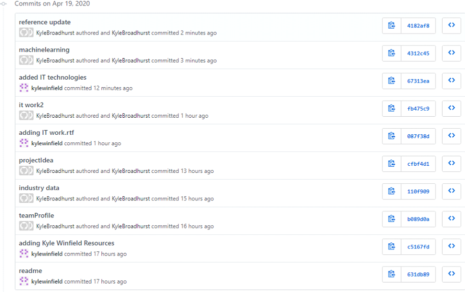

<html>
  <head>
    <h1> The Kyles</h1>
      <h2> Kyle Winfield </h2>
        
My name is Kyle Winfield, student number s3541867.
        I'm a 23 year old student studying IT, I have worked various jobs from casual hospitality to basic IT helpdesk support.
         
        I've been playing competitive video games for the last few years and spend most of my free time doing so. It is my main hobby and interest.
         
        My interest in it has developed from a young age, where I spent my time using the computer and playing video games. In school, I took an interest in computer networking and was quite passionate about it. Later on in my life, I worked for the DHHS doing level 1 IT help desk support.
        

         
        <a href="https://kylewinfield.github.io/Assignment1--My-Profile/">
        
Kyle Winfield's Profile
 </a>

         

        
         
        
         
        
         

      <h2> Kyle Broadhurst </h2>
      
 My name is Kyle Broadhurst, my student id is s3851557 and I'm a 23 year old born in Sydney and raised in Bendigo, currently living in Geelong I spend most of my days working at the local Kebab shop and going out with friends. To this day my highest education has been Year 12, I did briefly partake in an accounting course but I dropped it because it conflicted with my job.
       
      My dream is to play Dota 2 professionally, I have flown interstate to compete in events and it has been lots of fun. I have no official experience in IT besides living in the modern age but I am very interested in learning how our technology runs i.e coding.
      

       
      <a href="https://kylebroadhurst.github.io/Assignment01/">
      
Kyle BroadHurst's profile

      </a>
       
      
       
      
       
      
       

      <h2>Personality Comparison</h2>
      

      We found our team to score very high on the openness aspect, so we knew it would be a good idea to lay out the assignment early on and decide who does what, we also worked together on discord to keep communication lines open .
      

      <h2>Ideal Jobs Comparison</h2>
        <h3>Kyle Winfield's job ad</h3>
          
        <h3> Kyle Broadhurst's job ad</h3>
          

       

      

      Both our dream jobs require a great understanding of coding, with multiple years of prior experience. Both jobs need you to be a self motivated worker and are very rewarding for being so. The main difference between the jobs is the Singaporean one is more hardware based while the other one is entirely focused of software. It would be safe to safe both career plans follow a similar  path in the IT industry, just a difference in the outputs.
      

      <a href="https://github.com/kylewinfield/Assignment2">
      
Group repository

      </a>

</head>

<body>
  <h2>Industry Data</h2>
    

    Both our job titles are Software engineer. Software engineer ranks as the 11th most in demand job in the IT industry according to Burning Glass Technologies. The general skills required for these jobs are communication skills, problem solving,  writing, team work, troubleshooting, planning, time management, quality assurance, meeting deadlines, team building, multitasking, English and decision making, while the IT exclusive skills are SQL, Javascript, C#, C++, DLL, Git, .NET programming and project management.
 
Our groups IT specific skills rate quite highly in terms of demand from employers with SQL and Javascript topping the chart, it is a similar story with our general skills with our requiring chart toppers communication skills, problem solving and writing. The three highest IT specific not required by our job are JAVA, Microsoft windows and SAP while the three highest general skills not required are organisational skills, planning and being detail orientated.
 
After looking at the Burning Glass data, I've gained a better appreciation  and understanding of the skills  required for my ideal job, having the skills laid out like that makes me feel like my ideal job is actually more achievable and the steps towards it can be more easily taken.

  <h2>IT Work</h2>
    <h3>Software Engineer</h3>
     

     https://www.youtube.com/watch?v=vRSRElAIdsU

 
 
This IT professional is a project manager and is responsible for 3-4 projects to manage. He will constantly be checking monitoring the project to see if there are any changes from business needs, customer changing their mind or any other reason and react and adapt with his team as the changes happen.
 
He works closely with his teams around planning those projects, seeing what’s the next phase they are going in to, who is involved, what type of resources he needs, what is the budget, what is the timeline and then communicate this is to everyone in the team and all the stakeholders.
 
He will also look at other projects that have not started yet, so working with a management team, he will help set a vision and set expectation so they can start planning ahead of time to start resourcing for these projects.
 
He deals with various different people in his day to day life. He will directly work with various teams of software engineers to make effectively communicate and keep on top of the dynamic projects that he is responsible for. He must work with a team of project managers to start and help construct, plan and give insight into new projects for the company. The clients and stakeholders he must also be in constant communication with.

https://www.youtube.com/watch?v=5kas2jBObUY

 
 

She is a product engineer who works a lot of mobile apps, specifically apps related to social and productivity. The engineering she does is directly related to the product that people use.
 
The majority of her time is spent reading, writing and debugging code. This is the primary job of her role.
 
She will spend time working with a product managers, designers and other product engineers in order to make decisions on a project and help shape the direction of how the product will work.
Once the idea is shaped, she will collaborate with other product engineers to build the product.  
This includes coming up with a plan, deciding if she needs to collaborate with other teams in the company, deciding how to format data to show in the desired way and figuring out what resources are required for the product, and whether those resources need to have custom made versions.

    <h3>Network Engineer</h3>
      

      https://www.youtube.com/watch?v=qpUe7vQSsyI

 
 
This IT professional is a Network Engineer, his main job is to maintain the connectivity of computer networks in terms of voice, data and wireless network services within an organization.  
He will be monitoring the ticketing system from the organization's help desk team to see if any tickets have been escalated to him. This is the number one priority and what he spends most of his time doing, since user impact directly reflects on him and his skill to maintain a network.
 
There are also often various projects for him to do, such as firewall/switch migrations, network flow performance adjustments, internet redundancy tests, VoIP adjustments, firmware adjustments and more.  
These tasks are often shared with systems administration teams.
 
He will meet with business stakeholders to discuss potential issues that might come up from works and the progress he and his team are making on projects.

 

https://www.youtube.com/watch?v=qpZbRUEE_Dc
 
 
This IT professional is a Network Analyst, his main job is to monitor the stores that his company manages in terms of connectivity, and make sure these systems are running smoothly.
He provides level 3 help desk support to clients and will spend a lot of his time dealing with those tickets. This is usually resolving network issues with the clients. Anything with an IP address he will be helping resolve, problems can arise like when a site goes down, he will work with them to get it back up.
 
He will also collaborate with his team to write scripts to help out with automation.
A project he is currently working on is a backup connection device to all of the sites throughout his region, so that if any sites go down there will be a backup to keep it running while they get the site back up and running. This provides some usability while the issue is getting resolved.

<h3>Database Administrator</h3>

https://www.youtube.com/watch?v=Fp2DPhLM8Kw

 
 
This IT professional is a Database Administrator, her main role is supporting a specific data base software at her company.
 
She is responsible for maintaining the database ensuring there are no outages and then working her work queue. This queue will consist of some data base changes, helping fix any outages that she might get called in to do, or fine tuning from customer requests.
 
She works with other database administrators to resolve outages as well as direct contact with the clients that the database hosts for.

 

https://www.youtube.com/watch?v=ZNvn1mJwHiw

 
 
This professional is an Oracle Database Administrator.
First thing he will do in a typical day is check all the databases are up and running, and making sure they didn’t go out in the night and there are no problems.
Then he will check his backups, to make sure they are operational.
 
Direct contact to the clients is something a Database administrator needs to do, troubleshooting with clients and resolving any issue to make sure everyone has access to what they need to and the database itself is running smoothly.
He will have meetings with Project Managers and other Database Administers about upgrades and other things.
 
The rest of his role is mainly just monitoring the databases, making sure everything is running and handling client requests.

<h2>IT Technologies</h2>
  <h3>Blockchain and Cryptocurrency</h3>
  

  A blockchain is a growing collection of digital records, called blocks, that are linked through cryptography. Each block contains details of a timestamp, transactional data and the unique ‘cryptographic hash’ of the previous block in the block chain. In that sense all the blocks in the chain are linked.
   
The main benefit of using a blockchain is that it cannot be modified, making all the transactions in the blocks permanent and open to the public.
 
Blockchain can be used in banking, property records, smart contracts, voting, supply chains and most obviously, cryptocurrency.
Blockchain technology is implemented into cryptocurrencies, which are virtual or digital currencies that are secured by using blockchains.
According to Jan Lansky, a cryptocurrency is a system that meets six conditions:
The system does not require a central authority, its state is maintained through distributed consensus.
The system keeps an overview of cryptocurrency units and their ownership.
 
The system defines whether new cryptocurrency units can be created. If new cryptocurrency units can be created, the system defines the circumstances of their origin and how to determine the ownership of these new units.
 
Ownership of cryptocurrency units can be proved exclusively cryptographically.
The system allows transactions to be performed in which ownership of the cryptographic units is changed. A transaction statement can only be issued by an entity proving the current ownership of these units.
If two different instructions for changing the ownership of the same cryptographic units are simultaneously entered, the system performs at most one of them.
 
Cryptocurrencies can be used today online as a currency, with the main difference from other forms of currency being the parties involved are semi-anonymous and the currency itself is decentralized, making it immune from intervention from another party, like the government.
The future of cryptocurrency is an uncertain one, but some say that it needs a verified exchange trade fund, so that it is easier for people to invest in crypto’s like Bitcoin. While Bitcoin would still need to see some more demand, it would be the next step for cryptocurrency.

Some limitations of crypto are potential hackers and computer crashes can wipe out someone’s invested into whatever crypto they are invested in. In time, technological advances will help ease these issues.
The main issue with crypto is the paradox that if crypto becomes more popular it will attract more regulation from governing bodies, which defeats the purpose of crypto’s fundamental premise.
 
For a cryptocurrency to become part of the mainstream, it would need to be complicated enough to avoid fraud and hackers, but simple enough for consumers to understand and use. It would need to be decentralized, but with some appropriate safeguards for the user. It needs to keep users anonymous while not promoted nefarious activities.

 

The impact of block chains is potentially very useful, having a decentralized recording keeping system can be applicable in multiple ways. Firstly, by removing the need for human verification, the accuracy of the records is highly increased. This also decreases costs, since no human verification is needed.
The decentralization process makes it much harder for anyone to meddle with any transactions, as all the block chains are linked. This would mean all transactions cannot be changed, removed or hidden from anyone. The records are transparent.
 
For example, the use of block chains in banking is highly profitable as it could cut out potentially $20 billion in middleman costs, along with all the benefits that block chain provides, such as efficiency, transparency and privacy.
 
Another potential application is voting, while not ready yet, in future the potential for block chains to cast, track and count votes from verified users. This could get rid of the need for recounts and remove the potential of vote fraud or any tampering.

Block chain can be applied in a variety of ways to lots of different businesses. It’s efficiency and decentralized structure are very appealing for any record of transactions, as nearly all businesses would want this kind of transparency and efficiency.
 
Cryptocurrencies have interesting applications for global and various localized economies. Some countries, such as china, have made it increasingly difficult for people, including businesses, to spend the nation’s currency outside of the country. As a result, Bitcoin is coming more popular, especially since more businesses are accepting Bitcoin as a form of payment.
 
While in other countries that have become corrupt, cryptocurrency has become more popular. In both India and Venezuela banned their highest currency note in order to make it tougher to make accumulated black money useless, which boosts the demand for Bitcoin so citizens can send and receive money without needing to answer to the government.  
 
In my daily life, blockchains and cryptocurrency do not affect me very much at all. Cryptocurrency is an interesting new idea, but as it stands the need for it in my life does not exist and may not for many years.
 
Blockchain technology could start to be implemented in many ways as described above, possibly changing the way my bank transactions work or even my online shopping. Although these might be the closest ways, they impact me directly, I likely would not notice the difference from a consumer perspective.
 

<h3>Cybersecurity</h3>

Cybersecurity covers a wide range of threats to computer system and networks to access sensitive information. These can range from Denial-of-service attacks, ransomware, malware, phishing, social engineering etc.
As more businesses and individuals become reliant on computers, cybersecurity becomes increasingly more important.
 
Protecting computers and computer networks from these threats can come from different approaches. There’s educating the user, with teaching them about basic security principles such as password strength, two-factor authentication, backing up your data and knowing what suspicious emails look like.
Then there’s the technology layer, from software and hardware, such as more advanced routers, computers, networks, and smart devices that have newer features like firewalls, DNS filtering, malware protection and antivirus software.

Multi-factor authentication is a simple way to add extra layers of security to a network, account or device. There are 4 different types of factors for authentication. Something you have, something you know, something you are and somewhere you are.
 
By adding more factors to the authentication process, it effectively adds more layers to the security of the user’s subject.
Cybersecurity is a ever-evolving field of technology as the threats are constantly changing and updating, so the security must do the same in order to keep up.
 
The impact of cybersecurity is huge and extremely important in this day and age. Almost every business, government or any other organization has sensitive information that needs to be protected. These groups will desperately need IT departments that can support their cybersecurity needs.
On top of that there are PCs that need protecting, user’s personal information, passwords, financial details, photos, files etc. are all private data that everyone needs to protect from hackers. There are plenty of stories you hear about with stolen credit card information, cybersecurity is vital to protect people.
 
Nearly everyone is affected by cybersecurity, the risk of not being secure online is far too great considering the purpose of what you do online. Online shopping, using social media, or even just browsing the wrong webpage can all be exploited for your information unless you have some security of some sort on your PC and/or network.
Here we can see more jobs being available for various reasons. Cybersecurity is a constantly changing technology, as more security threats and vulnerabilities are being discovered, new security must be developed in order to combat it.
 
You also need people installing said cybersecurity, whether it be software or hardware.
There are also hackers that are hired in order to explore potential vulnerabilities in cybersecurity systems so that the developers of that system can fix these vulnerabilities, ensuring a strong product for the consumer.

The impact of Cybersecurity on my life is significant, as I am spending majority of my time online. The security of my PC, my phone and my home network are of great importance to my lifestyle.
 
Using a combination of antivirus software, anti-malware software and firewalls, I can stay online safely without worrying about corrupting my PC, or giving up and sensitive information, such as passwords, personal information, bank account details or credit card details.
 
My friends and family will and need to use similar precautions as in the digital age, everyone’s information is sensitive and needs to be protected from cyber threads.

References:

<h3> Autonomous Vehicles</h3>

Self-driving car technology is becoming more economically and commercially viable for a multitude of different reasons. Previously it wasn’t viable to make automated cars due to large costs of the design, building and maintenance of the technology. The safety of the automated cars is another significant improvement in recent times that actually prove that automated vehicles are better drivers than human drivers. This is especially relevant since nearly all car crashes (94%) are caused by human error.
 
The following table describes different levels of automation.
Table 1. Levels of automation

 
Currently SAE levels 1 and 2 are already available on the market and can be used on the roads. Higher level automation vehicles are being tested and developed in controlled environments.
The goal for this development is to have driverless cars at SAE level 5 and it is coming very soon. As technology improves, sensors, radars, cameras will become more developed, to the point where it can be combined to produce fully automated cars capable of being used without human monitoring or intervention.

 

The auto industry predicts we are just 5-10 years away from automated vehicles appearing on the market. This rise in automated vehicles is likely to result in the rise of transport-as-a-service, which is a move away from the privately owned vehicles and is more about different modes of transport as a service. This type of service is predicted to be significantly more affordable than the current paradigm that is privately owned vehicles.
 
This could completely change the way we use transport today, reducing the number of road accidents, increased productivity from not needing to drive, improving roads from traffic efficiency and congestion and financially more efficient.
People will not need to own cars as it is likely to be more financially beneficial for the consumers and businesses alike to use automated vehicles for transporting people or goods.

Employment regarding automated vehicles will be a transformation of the current automobile industry, while potentially removing all jobs related to humans driving (taxis, trucks, buses, deliveries etc.). While it will remove some jobs, it will also create new jobs requiring new skills. These new jobs would consist of things like roles in supplying, maintaining and operating automated vehicles.
 
According to the DIIS, workers that are currently employed as professional drivers are generally less educated, older and have few transferable skills, which could potentially make it harder for these people to find new jobs in the future.

This could drastically affect my personal life as there may not be a need for privately owned cars. I may not need to spend money purchasing, registering, maintaining and fuelling my own car while this alternative comes into play. From the finding, it will be more financially viable for someone like myself to use a transport-as-a-service instead.
 
The same is true for my family and friends and indeed anyone, so much of world is run by cars, trucks and buses for transporting people and goods. This would be a drastic change for the world once it comes into full effect.

     

<h3>Machine Learning</h3>

Machine learning is all about using computer algorithms that self improve via repetition. They mainly use point systems to train the ai, where a point is given as reward for completing a certain objective and then the ai figures out the best way to gain the most amount of points. The technology is advancing at a rapid pace, just a few years ago the team at OPEN AI were able to make a program that beat the best players in the world in a video game called Dota 2.
 
It was able to outthink and outsmart the players that had played this game their entire lives using their point based learning systems. Machine learning is currently used today in such a large amount of fields including banking, stock markets, online advertising and agriculture. Machine learning is responsible for helping oil company find billions of barrels worth of oil hidden in the ground, it helps museums analyse paintings and find common influences in artists and even predicted the 2008 financial crisis. Machine learning is responsible for the development of personal assistants used by Google amazon and Apple, They're used in video surveillance overseas to help predict bad behaviour and are even what we google uses to try and keep our email spam free.

Its impossible to say what is likely to be done soon, it really depends on the new challenges that the world faces. As we advance our computing power, machine learning will become faster which will mean we will be able to solve more complex problems faster. machine learning is currently being used to help develop a cure for Covid-19, by analysing the effects of different substances and compiling them together into theoretical drugs. The things that makes developments in the field of machine learning possible are better hardware and more efficient learning methods, who knows when the next big breakthrough will be.
 
The potential impact of machine learning improving wouldn't be a noticeable difference. It would mean problems get solved faster, its difficult to really discuss what would change except for the ease on business', they would save money on computing power required, wage spent on staff due to faster development time and of course faster project turnaround time.  

Although its hard to discuss the impact this will have on the technology, the applications it will have in relation to my life will be felt daily. My Google virtual assistant will become scarily human, and there are already talks about it learning how to tell your mood just by your voice. The advertisements targeted against me will become solely things I want and advertised in probably the most ideal way to get me to buy them. My google maps will become much more efficient at reading traffic and closed routes and will be able to direct me to the most efficient route. My Facebook feed will become much more targeted against me, on a much similar vein as advertising.
 
My gmail will be spam free and online customer support will be able to tell my problems much easier than I could ever describe them. Basically machine learning would be responsible for improving every aspect of my IT life, and its and exciting thought for sure.

<h2>Project Idea</h2>

For this assignment we have decided to build off of Kyle's idea of making an ai based game in Unity, Which has the player make an MMO by placing down zones which the ai will then use to level itself up and fill requirements.  There are plans for a variety of features including bosses, training zones and a completely ai run market that has adjusting prices from supply and demand to match a real MMO market.
 

The goal of the game is to make money while keeping the ai players wants and needs fulfilled, this is going to add a nice layer of challenge for the human player which will keep the game interesting and fun. The ai is the main focus of the game,  they will be spawned into the world with randomly generated stats which will give them different weightings towards bossing or socialising for example, this is to make sure there is no set strategy for beating this game and will make every playthrough feel unique.

 Structures and building zones are to fill the needs of the ai, these will include things such as boss zones, city zones and skilling stations. These areas will adjust the ai want and need bars based on weighting and how long the ai was there for. Money is a key aspect of the game and is there to give a sense of progression for the human player, this will impact the human players ability to grow their game world and dictate how much ai can be spawned in at a time, like a theoretical server limit.
  

We have taken feedback from Tim and have decided to add some new ideas of our own to this project. Firstly, we will be using Azure to help with the ai design and making sure it acts as intelligently as possible, we may also be able to use machine learning to make sure the ai reaches certain goals and has the amount of activity ratio's we desire. We have also explored the possibility of doing a mobile launch, this would provide us with a much larger potential playerbase.

This would come with a few unique challengers for us such as remaking the game for mobile or porting it, learning about how to stand out in the mobile marketplace which is vastly different to something like steam. Adding on from previous talks about the project, we have decided to add co-op play, in which people can join your current save and build with you. This will add an extra layer of difficulty for us as it means we would have to learn about net coding, as well as different methods for handling save games.

<h2>Group Reflection</h2>

Kyle Winfield:

During this assignment there were mostly only problems due to time constraints that were very avoidable. The main problem is the lack of group members that occurred due to leaving the assignment to a very late date for completion and not being to find other group members to work with us.

This caused a high work load in a short amount of time. While manageable it wasn’t particularly easy. However only have one other person in my group, it made communicating and organizing the assignment very easy as we could quickly split the work load and get started straight away, uploading pieces of the assignment as we finish it and then lastly compiling the whole assignment together.

It was surprising how efficient it was only needing to work with one other person, fewer lines of communication can lead to quick and effective teamwork.
The assignment could definitely be improved if I had started earlier and worked with a bigger group but at the same time, more people creates more potential for organizational issue in my opinion.

The github trail reflects basically exactly what each of us worked on, each commit is a piece of the assignment that we then can use to compile into a single pdf and create the website.

 

Kyle Broadhurst:
 
What went well:
We were able to work efficiently and quickly once we realised that our group was going to be just us. We had really effective communication and were able to quickly allocate work to be done.

What could be improved:
 
In the future, we should be more proactive in seeking out group members, to make sure we can find other active people to work with. We could of started working much earlier, to avoid a crunch, and to improve the overall quality of the work.

One surprising thing:
 
I was surprised at how quickly we were able to do the work, and how easy it was to work together, I thought there would be more difficulty in allocating work but it was fine.
What I learned about groups
 
I learned that working in a group can have some issues, even with the best of planning, I also learned that playing to the strengths of your groupmates is very important.
 

 

<foot>
  <h2> References</h2>
  <ol>

  <li>http://si-journal.org/index.php/JSI/article/viewFile/335/325</li>
  <li>https://www.investopedia.com/terms/c/cryptocurrency.asp</li>
  <li>https://www.investopedia.com/terms/b/blockchain.asp</li>
  <li>https://www.cbinsights.com/research/industries-disrupted-blockchain/</li>
  <li>https://www.outsource2india.com/software/articles/impact-cryptocurrency-bitcoin.asp</li>
  <li>https://www.investopedia.com/articles/forex/091013/future-cryptocurrency.asp</li>

  <li>https://www.cisco.com/c/en_au/products/security/what-is-cybersecurity.html</li>
  <li>https://us.norton.com/internetsecurity-malware-what-is-cybersecurity-what-you-need-to-know.html</li>
  <li>https://www.onelogin.com/learn/what-is-mfa</li>
  <li>https://www.parliament.vic.gov.au/publications/research-papers/download/36-research-papers/13839-automated-vehicles</li>
  <li>https://www.racv.com.au/on-the-road/driving-maintenance/road-safety/car-safety/autonomous-vehicles.html </li>

<li>https://medium.com/app-affairs/9-applications-of-machine-learning-from-day-to-day-life-112a47a429d0</li>
  </ol>

<html>
